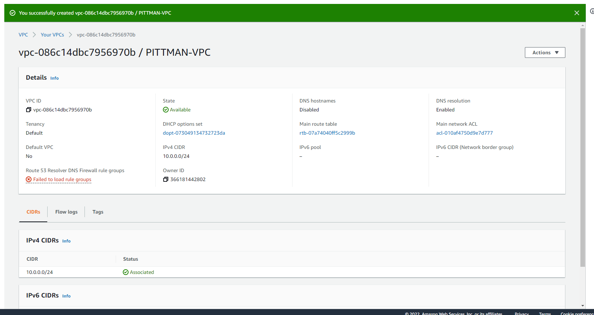
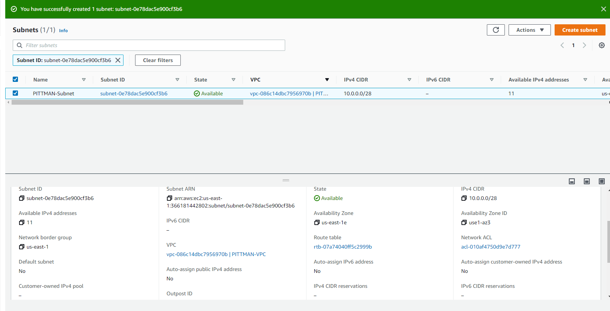
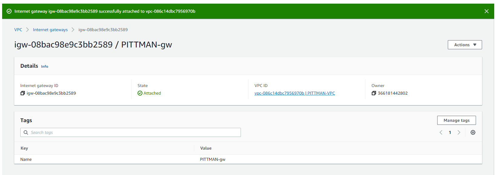
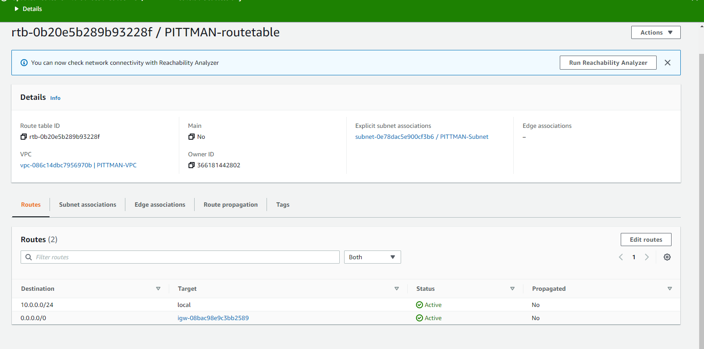
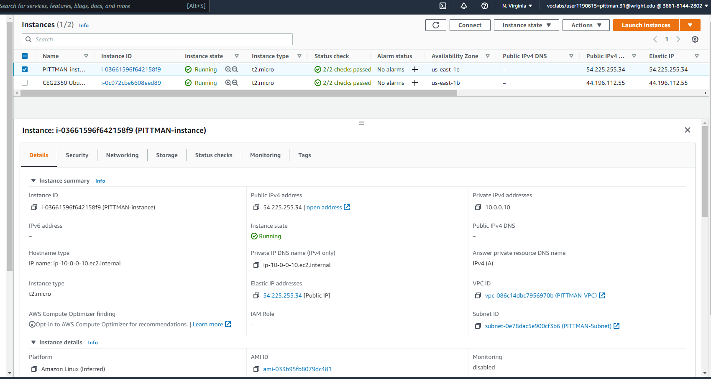
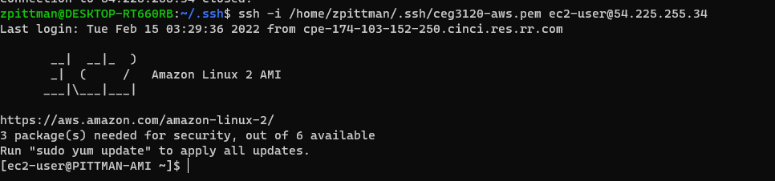

## Part 1 - Build a VPC

1. Create a VPC.
   
   - A VPC is a virtual network dedicated to your aws account
2. Create a subnet
   
   - A subnet is a range of ip addresses in the vpc
3. Create an internet gateway
   
   - An internet gateway is a computer that routes traffic from you private network to outside your network
4. Create a route table
   
   - A routing table has ruled dictating where to direct your network traffic
5. Create a security group
      
   - A security group is a network layer firewall

## Part 2 - EC2 instances

1. Create a new instance. Give a write up of the following information:
   - AMI selected - Amazon Linux 2 AMI (HVM) - Kernel 5.10, SSD Volume Type - ami-033b95fb8079dc481 (64-bit x86) / ami-0f7691f59fd7c47af (64-bit Arm)
     - default username - ec2-user
   - Instance type - t2.micro
2. Attach the instance to your VPC - I attached my vpc to this instance in the instance details page.
3. Determine whether a Public IPv4 address will be auto-assigned to the instance - I did not auto-assign a public ip address. This is so that amazon cannot take my public ip and assign it to another customer.
4. Attach a volume to your instance - Under the add storage in the lauch instance wizard I added a 16gb ssd volume.
5. Tag your instance with a "Name" of "YOURLASTNAME-instance"- Under the Add Tags sections of the Launch Instance wizard, I added a tag with a key of "Name" and value of "PITTMAN-instance"
6. Associate your security group, "YOURLASTNAME-sg" to your instance. - Under the Configure Security Group section of the Lauch Instance wizard I selected "PITTMAN-sg" from an existing security group
7. Reserve an Elastic IP address.- Under Elastic IPs, I allocated a public ip and then associated it with my PITTMAN-instance.
8. Create a screenshot your instance details and add it to your project write up.
   
9. `ssh` in to your instance. Change the hostname to "YOURLASTNAME-AMI" where AMI is some version of the AMI you chose. Say how you did it.
   - I changed my hostname with the following command `sudo hostname PITTMAN_AMI`
10. Create a screenshot your ssh connection to your instance and add it to your project write up - make sure it shows your new hostname
