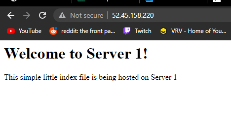
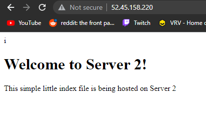

## Part 2 - Setup Load Balancing TODOs

Setup the following and add documentation or screenshots to your `README.md` file as specified.

1. Create an `/etc/hosts` OR `.ssh/config` file on each system that correlates hostnames to private IPs.
   - I created a .ssh/config file on each system with the following contents
    >Host proxy  
    >&nbsp;&nbsp;&nbsp;&nbsp;HostName 10.0.0.10  
    >&nbsp;&nbsp;&nbsp;&nbsp;User ubuntu  
    >&nbsp;&nbsp;&nbsp;&nbsp;IdentityFile ~/.ssh/ceg3120-aws.pem  
    >Host webserv1  
    >&nbsp;&nbsp;&nbsp;&nbsp;HostName 10.0.1.10  
    >&nbsp;&nbsp;&nbsp;&nbsp;User ubuntu  
    >&nbsp;&nbsp;&nbsp;&nbsp;IdentityFile ~/.ssh/ceg3120-aws.pem  
    >Host webserv2  
    >&nbsp;&nbsp;&nbsp;&nbsp;HostName 10.0.1.11  
    >&nbsp;&nbsp;&nbsp;&nbsp;User ubuntu  
    >&nbsp;&nbsp;&nbsp;&nbsp;IdentityFile ~/.ssh/ceg3120-aws.pem  
2. Document how to SSH in between the systems utilizing their private IPs.
    - This can be done by using the hostnames tied to the associated private ips above. An example of this would be  
    >ssh webserv1  
    >ssh -i ~/.ssh/ceg3120-aws.pem ubuntu@10.0.1.10
3. **_HAProxy configuration & documentation requirements_**
   - How to set up a HAProxy load balancer
     - What file(s) where modified & their location  
        >/etc/haproxy/haproxy.cfg
     - What configuration(s) were set (if any)  
        >frontend 52.45.158.220  
        >&nbsp;&nbsp;&nbsp;&nbsp;bind 10.0.0.10:80  
        >&nbsp;&nbsp;&nbsp;&nbsp;default_backend web_servers
        >backend web_servers  
        >&nbsp;&nbsp;&nbsp;&nbsp;balance roundrobin  
        >&nbsp;&nbsp;&nbsp;&nbsp;default-server check maxconn 20  
        >&nbsp;&nbsp;&nbsp;&nbsp;server webserv1 10.0.1.10:80  
        >&nbsp;&nbsp;&nbsp;&nbsp;server webserv2 10.0.1.11:80  
     - How to restart the service after a configuration change  
        >sudo systemctl restart haproxy
     - Resources used (websites)  
        >https://www.haproxy.com/blog/the-four-essential-sections-of-an-haproxy-configuration/
4. **_Webserver 1 & 2 configuration & documentation requirements_**
   - How set up a webserver
     - What file(s) were modified & their location  
        >N/A
     - What configuration(s) were set (if any)  
        >N/A
     - Where site content files were located (and why)  
        >/var/www/html/index.html
     - How to restart the service after a configuration change  
        >sudo systemctl restart apache2
     - Resources used (websites)  
        >https://www.digitalocean.com/community/tutorials/how-to-install-the-apache-web-server-on-ubuntu-20-04
5. From the browser, when connecting to the proxy server, take two screenshots.
   - one screenshot that shows content from "server 1"  
        >
   - one screenshot that shows content from "server 2"  
        >
6. (Optional) - link to your proxy so I can click it.  
    >[Proxy](http://52.45.158.220/)